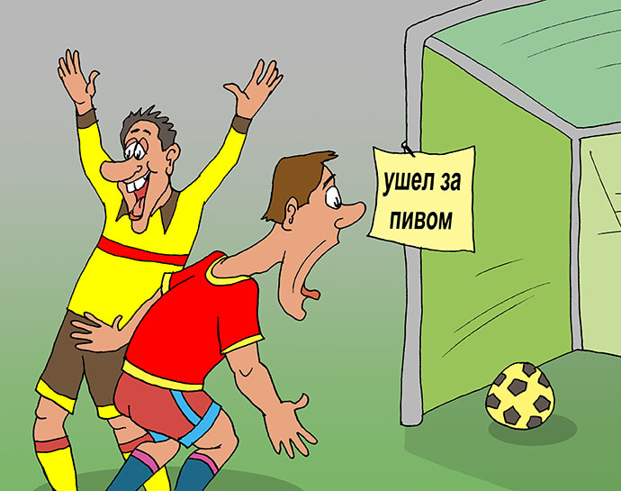

# Предсказание итогов футбольного матча
----

    

Благодаря энтузиазму, вызванному идущей Лигой Чемпионов и грядущим Чемпионатом Европы, наша команда решила посвятить проект футболу, а точнее построению модели, которая могла бы предсказать итог матчей, основываясь на самой базовой предварительной информации. Сразу хотелось бы отметить, что модель не является практически применимой, так как основана на данных 8-летней давности, а потому не является "финансовой рекоммендацией" для ставок и прочего рода азартных побуждений. Тем не менее, модель можно переобучить на более современных данных, сделав ее гораздо более релевантной.

### Шаг №1: Сбор данных
----
Данные по футбольным матчам мы взяли с платформы kaggle (https://www.kaggle.com/datasets/hugomathien/soccer/discussion/479796), которые включали в себя историю матчей в крупнейших европейских лигах с сезона 2009/2010 по сезон 2015/2016, а также рейтинги различных показателей огромного количества игроков этих лиг, составленные EA Sports для видеоигры FIFA. 

### Шаг №2: Обработка данных
----
Выбранные данные необходимо было значительно обработать, так как они включали в себя 7 таблиц, в которых располагалась информация о почти 26 000 матчей, сыгранных на протяжении 6 лет, а также полторы тысячи рейтингов команд и более 180 000 рейтингов игроков (такое огромное количество рейтингов обуславливается тем, что они, естественно, периодически обновляются, иногда даже чаще, чем раз в год). Для того, чтобы избежать переобучения модели (а также потери нескольких лет, которое это обучение могло бы составить), от многих данных и характеристик пришлось отказаться, однако подробнее уже в самом проекте.

### Шаг №3: ML
----
Было рассмотрено три подхода к построению модели на основе этого фрейма. Сначала в качестве таргета мы выбрали разницу между забитыми двумя командами мячами. При таком подходе требуется решать задачу регрессии. К сожалению, ни одна модель не смогла сделать это хоть сколько-нибудь удовлетворительно, в связи с чем мы изменили методику и перешли к задаче классификации.
Отныне задачей будет предсказывание лишь победителя матча (ну или ничьи). Мы построили обычную LogReg, XGBClass и XGBRFClass и поняли, что ни одна из моделей не может выдать ROC-AUC выше 0,65.
Исходя из этого, можно сделать только один вывод: предсказывать исходы реальных футбольных матчей по карточкам из FIFA почти невозможно. Видимо, для этого нужно намного больше данных и совершенно другой подход к решению задачи. Поэтому всем тем, кто захочет заняться чем-то подобным в будущем, мы можем лишь посоветовать серьёзно прорефлексировать все те жизненные решения, которые привели человека к столь незавидной перспективе.